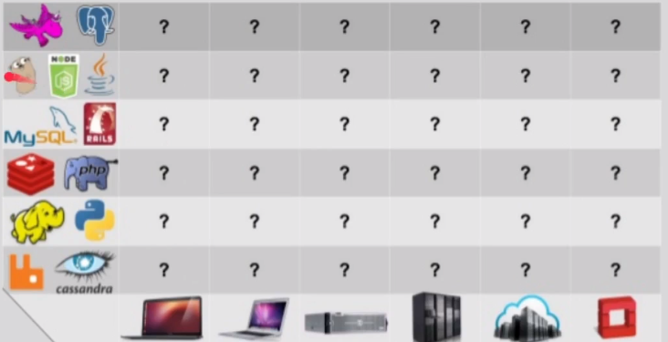

# O que é
- software que reduz complexidade de setup de aplicações
- configura-se containers que são como servidores para rodas as aplicações
- pode-se criar ambientes independentes qeu funcionam em diversos SO's
- deixa os projetos performáticos
- pouco tempo gasto em manutenção
- livra da matrix from hell
  - aplicações complexas e diferentes
  

# Versões docker
## CE X EE
- **CE -> Community Edition**
  - gratuita,
  - possibilita utilizar docker normalmente
- EE -> Enterprise Edition
  - paga
  - há uma garantia maior das versões disponibilizadas e tem suporte do time do docker

# Links
- https://docs.docker.com/engine/install/ubuntu/
- https://docs.docker.com/desktop/install/ubuntu/
- https://phoenixnap.com/kb/cannot-connect-to-the-docker-daemon-error